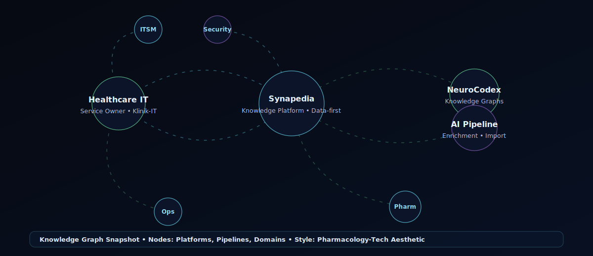

<!-- =========================
 Florian Lux • GitHub Profile README
 Pharmacology-Tech Aesthetic • Neural Banner • Knowledge Graph
========================= -->

  <!-- 1) Add this file in your repo: assets/neural-banner.svg -->
  

<h1 align="center">Hi 👋, I'm Florian Lux</h1>

<h3 align="center">
Service Owner in Healthcare IT • Full-Stack Developer • Knowledge Systems Builder
</h3>

  Building data-driven knowledge platforms at the intersection of <b>science, AI and technology</b>.

  

  <a href="https://synapedia.com"><b>Synapedia</b></a> •
  <a href="https://github.com/florianlux/neurocodex"><b>NeuroCodex</b></a> •
  <a href="https://buymeacoffee.com/florianlux"><b>Support</b></a>

  
  
  

---

## 🧬 Knowledge Graph Snapshot

  <!-- 2) Add this file in your repo: assets/knowledge-graph.svg -->
  

---

## 🧠 About Me

💻 **Currently building**  
**Synapedia** — a structured knowledge platform for psychoactive substances combining scientific data, AI enrichment pipelines, and modern web technologies.

🔬 **Exploring**  
**NeuroCodex** — experimental knowledge graphs and cognitive systems connecting neuroscience, pharmacology, and data.

🤝 **Open to collaborate on**  
AI pipelines • knowledge systems • data platforms • open science tooling.

🌱 **Currently learning**  
Large-scale data pipelines, knowledge graphs, AI architecture, and advanced system design.

💬 **Ask me about**  
Healthcare IT infrastructure, Next.js platforms, Supabase architectures, and AI-driven data systems.

⚡ **Fun fact**  
By day I work as a **Service Owner in Healthcare IT for a large hospital group** — by night I build experimental knowledge platforms.

---

## 🚀 Featured Projects

### 🧠 Synapedia — Pharmacology Knowledge Platform
A structured, data-first platform combining scientific sources with AI-assisted enrichment and modern UX patterns.  
🔗 https://synapedia.com

**Focus:** data quality • evidence signals • structured schemas • safe/neutral knowledge design

---

### 🔬 NeuroCodex — Knowledge Graph Experiments
An experimental knowledge graph exploring connections between neuroscience, pharmacology, and cognitive systems.  
**Focus:** graph modeling • relationship inference • interactive visualization

---

## ⚙️ Tech Stack

  

  
    TypeScript • Next.js • React • Supabase/Postgres • Cloudflare/Netlify • AI Pipelines • Data Engineering
  

---

## 📊 GitHub Stats

  
  

---

## 📈 Contribution Graph

  

---

## ☕ Support My Work

If you like my projects and want to support independent knowledge platforms like **Synapedia**, you can support me here:

  
  

---

  🧠 <b>"Building knowledge systems that connect science, data and technology."</b>

<!-- ==========================================
SETUP NOTES (do this once):
1) Create folder: assets/
2) Add files:
   - assets/neural-banner.svg
   - assets/knowledge-graph.svg
========================================== -->
